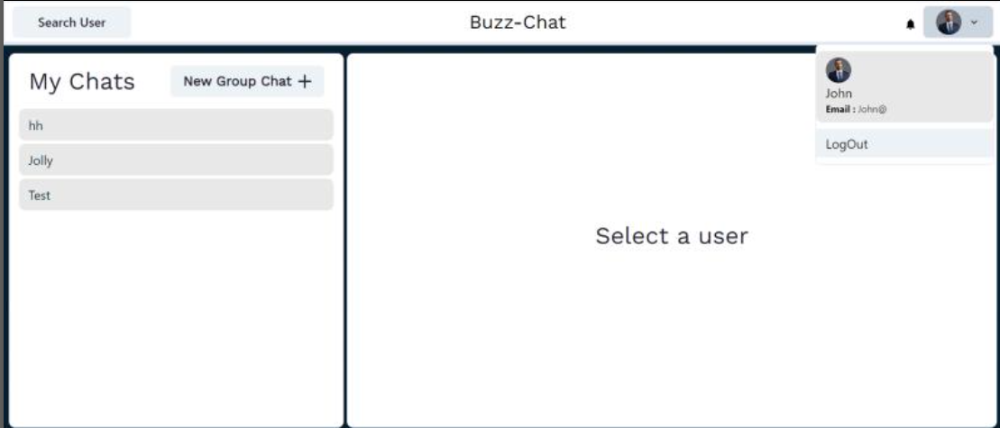

# Buzz-Chat 

## Table of Contents

- [Features](#features)
- [Guide](#guide)
- [Technologies Used](#technologies-used)

  
## Features

- **A real time chatting application.**
- **Can make a profile or involve as a guest user.**
- **Make groups and multicast messages within the group.**

## Guide

**Login or Signup with required details.**:

**View message your Chat history.**:

**Make group and look for profile of your friends.**:  

## Technologies Used

- **React**: For front-end development.
- **MongoDB**: For database management.
- **NodeJs.**: For backend.
- **ExpressJs.**: For backed.
- **Socket.io**: For real time chatting experience.

## Future Scope

- **Enhance security of messaging**: We can encrypt the chats for more security.
- **Use cloud for storage**: We can store messages on cloud for better performance.

Thank you!!
